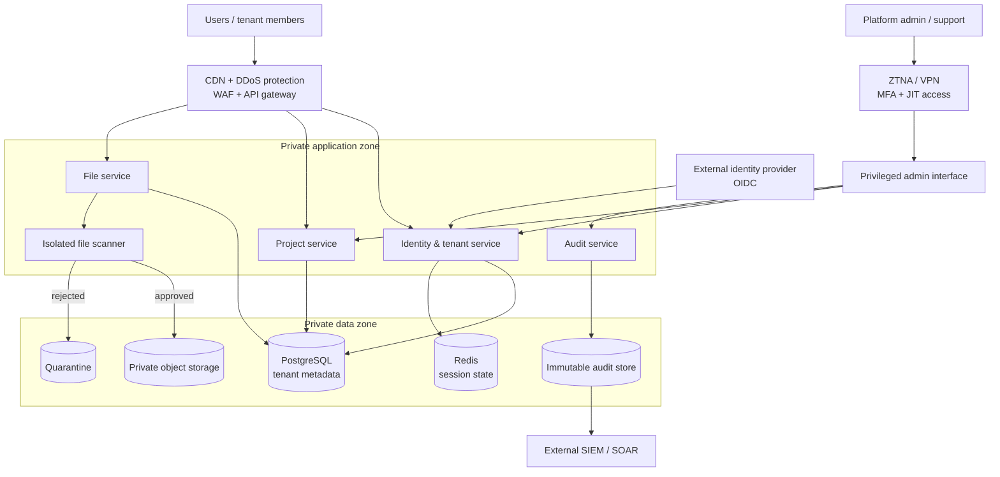

# Multi-Tenant SaaS Security Architecture

<p>
  An implementation-neutral security reference for a shared-cloud B2B SaaS platform,<br>
  with tenant-isolation threats traced to requirements, controls, tests, and operations.
</p>

<p>
  <a href="#scope"></a>
  <a href="docs/threat-model/03-stride-analysis.md"></a>
  <a href="docs/architecture/05-security-requirements.md"></a>
  <a href="docs/controls/01-control-matrix.md"></a>
</p>

This repository models the security architecture for a SaaS collaboration platform where organizations share application, API, database, and storage infrastructure. It focuses on the failure modes that matter most in that model: cross-tenant access, broken authorization, identity compromise, unsafe file handling, privileged access, evidence tampering, and resource abuse.

The material is intended for security architects, application and platform engineers, reviewers, and threat-modeling workshops. It connects business assumptions to concrete security requirements and verification scenarios without prescribing an application language or framework.

> [!IMPORTANT]
> This repository is a **design reference**, not a deployed system, application implementation, compliance certification, or claim of production readiness. Its controls and recovery objectives must be implemented, tested, and adapted to the target environment.

## Scope

The reference platform supports tenant organization management, invitations and membership, project and task collaboration, file upload and sharing, REST API integrations, credential lifecycle management, tenant audit-log access, and controlled support operations.

Its security model emphasizes:

- **Tenant isolation at every layer** — trusted tenant context, object-level authorization, tenant-scoped data access, and optional PostgreSQL Row-Level Security as defense in depth.
- **Authentication without implicit authorization** — OIDC establishes identity; services still validate membership, ownership, permission, and operation.
- **Separated privileged access** — MFA, step-up authentication, just-in-time privilege, network restrictions, and detailed audit trails for support and platform administrators.
- **Untrusted file processing** — content validation, malware scanning, quarantine, resource limits, and authorization before retrieval.
- **Recoverable security operations** — centralized immutable evidence, incident containment, isolated backups, restore testing, and explicit residual-risk ownership.

## Reference architecture

The model separates untrusted entry points, private application services, restricted data stores, external trust dependencies, and a distinct administrative path.



The Mermaid view is intentionally compact. The editable Draw.io sources cover the [system context](diagrams/context.drawio), [security architecture](diagrams/security-architecture.drawio), [authentication flow](diagrams/auth-flow.drawio), [data flow](diagrams/data-flow.drawio), and [AWS-styled deployment](diagrams/deployment.drawio) in more detail.

## Threat-to-control traceability

The repository is organized as a traceability chain:

```text
Business context and assets
        ↓
Trust boundaries and attack surface
        ↓
STRIDE threats, abuse cases, and attack trees
        ↓
SR-01 through SR-49 security requirements
        ↓
CM-01 through CM-14 preventive and detective control mappings
        ↓
Negative tests, security gates, incident response, and residual-risk review
```

The highest-priority scenario is a tenant-boundary failure. The model requires the responsible service to evaluate authenticated identity, trusted tenant context, resource ownership, user permission, and requested operation before granting access. An API gateway may reject invalid authentication or routes, but it is not the sole authorization enforcement point.

Other end-to-end scenarios include forged or replayed tokens, vertical privilege escalation, malicious uploads, unauthorized file retrieval, API credential theft, audit-log tampering, denial of service, and compromised platform administrators.

## Design decisions

Two recorded decisions are explicitly marked accepted:

- [ADR-002: JWT access tokens vs opaque sessions](adr/ADR-002-jwt-vs-opaque-sessions.md) selects short-lived JWT access tokens with rotating, server-side opaque refresh tokens. This preserves distributed access-token validation while enabling refresh-session revocation and reuse detection.
- [ADR-003: centralized authorization](adr/ADR-003-centralized-authorization.md) centralizes policy management while keeping final enforcement in the responsible service. Policy-evaluation failure must fail closed.

Related design positions appear throughout the control documents:

- File metadata stays in PostgreSQL while binary content remains in private object storage.
- Presigned URLs are narrow, short-lived capabilities issued only after application authorization.
- Verification-only credentials are hashed; recoverable integration secrets use protected encryption and managed keys.
- Critical security events leave application workloads for centralized, integrity-protected storage and SIEM analysis.
- Internal services receive only the network and datastore access required by their responsibilities.

> [!NOTE]
> [`ADR-001-shared-vs-isolated-database.md`](adr/ADR-001-shared-vs-isolated-database.md) currently contains logging and monitoring guidance rather than the database-tenancy decision named by the file. The repository therefore does not yet record an accepted shared-versus-isolated database choice.

## Documentation map

### Architecture and requirements

- [Business context](docs/architecture/01-business-context.md) — users, goals, assumptions, and excluded product areas.
- [Security-relevant functional scope](docs/architecture/02-functional-requirements.md) — eight platform capabilities and their security impact.
- [Security considerations](docs/architecture/03-security-considerations.md) — the primary risks driving the design.
- [Assets and data classification](docs/architecture/04-assets-and-data-classification.md) — confidential and restricted platform assets.
- [Security requirements](docs/architecture/05-security-requirements.md) — 49 normative requirements across isolation, identity, APIs, files, credentials, audit, availability, and service-to-service security.

### Threat model

- [Trust boundaries](docs/threat-model/01-trust-boundaries.md) — internet, application, data, IdP, monitoring, privileged, tenant, and file-processing boundaries.
- [Attack surface](docs/threat-model/02-attack-surface.md) — exposed interfaces ranked from high to critical priority.
- [STRIDE analysis](docs/threat-model/03-stride-analysis.md) — spoofing, tampering, repudiation, information disclosure, denial of service, and elevation of privilege.
- [Abuse cases](docs/threat-model/04-abuse-cases.md) — ten concrete attacker workflows with impacts and security requirements.
- [Attack trees](docs/threat-model/05-attack-trees.md) — multi-step paths to tenant data, administrative privilege, and related security objectives.

### Security controls

- [Control matrix](docs/controls/01-control-matrix.md) — 14 threats mapped to requirements, controls, and verification methods.
- [Authentication and sessions](docs/controls/02-authentication-and-session-security.md) — token validation, refresh rotation, revocation, session protection, and privileged authentication.
- [Authorization and tenant isolation](docs/controls/03-authorization-and-tenant-isolation.md) — entry-, service-, and data-layer enforcement.
- [API security](docs/controls/04-api-security.md) — BOLA/BFLA prevention, strict schemas, output minimization, and abuse controls.
- [Secrets and key management](docs/controls/05-secrets-and-key-management.md) — hashing, encryption, KMS, lifecycle, scope, and auditability.
- [Network and infrastructure security](docs/controls/06-network-and-infrastructure-security.md) — edge protection, segmentation, east-west restrictions, private data access, and egress control.

### Security operations

- [Logging and monitoring](docs/operations/01-logging-and-monitoring.md) — event coverage, sensitive-data exclusions, one-year retention, SIEM, and guarded automated containment.
- [Incident response](docs/operations/02-incident-response.md) — severity, containment, evidence preservation, recovery, and post-mortems.
- [Backup and recovery](docs/operations/03-backup-and-recovery.md) — isolated encrypted backups, a 15-minute RPO target, a four-hour RTO target, and quarterly restore tests.
- [Security testing plan](docs/operations/04-security-testing-plan.md) — source, dependency, secret, API, tenant, file, infrastructure, container, dynamic, and penetration testing.
- [Residual risks](docs/operations/05-residual-risks.md) — time-bound treatment and ownership for risks that cannot be eliminated.

## Using the repository

There is no application to install or service to start. Clone the repository and review the documents in the order that matches your task:

```bash
git clone https://github.com/0xn3by/security-architecture.git
cd security-architecture
```

For a first architecture review:

1. Confirm that the [business context](docs/architecture/01-business-context.md), data classifications, and exclusions match the system being designed.
2. Walk each flow across the [trust boundaries](docs/threat-model/01-trust-boundaries.md) and editable diagrams.
3. Challenge the model with the [abuse cases](docs/threat-model/04-abuse-cases.md) and [attack trees](docs/threat-model/05-attack-trees.md).
4. Trace applicable threats through the [security requirements](docs/architecture/05-security-requirements.md) and [control matrix](docs/controls/01-control-matrix.md).
5. Assign implementation owners and convert verification methods into executable tests and release gates.
6. Record unresolved assumptions, accepted exceptions, compensating controls, expiry dates, and reassessment owners.

The `.drawio` files are editable sources; open them in a compatible Draw.io editor when adapting zones, data flows, providers, or service boundaries.

### Example tenant-isolation check

Use synthetic tenants and opaque resource identifiers when converting the control matrix into tests:

```text
Given:  a valid Member session for Tenant A
And:    a project owned by Tenant B
When:   the caller requests the Tenant B project identifier
Then:   the service denies the request
And:    no Tenant B fields or existence details are disclosed
And:    the authorization failure is recorded with safe tenant and request context
```

Repeat the same negative test across projects, tasks, files, users, memberships, audit records, integrations, bulk endpoints, and administrative functions.

## Security validation

The documented verification strategy expects:

- SAST, software-composition analysis, and secret scanning on pull requests.
- DAST against staging plus API tests for authentication bypass, BOLA/BFLA, injection, excessive disclosure, and rate or payload controls.
- Cross-tenant and role-boundary negative tests as deployment gates.
- Malicious-file, disguised-file, archive-bomb, quarantine, and scanner-failure tests.
- Infrastructure, container, IAM, storage-exposure, encryption, and egress validation.
- Periodic penetration testing and threat-model review after material architecture changes.

These are planned assurance activities. The repository currently contains no executable test harness, CI workflow, infrastructure definition, or deployed control evidence, so none of the controls should be treated as verified by this repository alone.

## Assumptions and boundaries

The model assumes a public-cloud deployment, an external OAuth 2.1/OIDC identity provider, private-by-default object storage, and confidential customer data. The deployment drawing uses AWS-style components, but the requirements remain largely provider-neutral.

The documented product scope excludes billing and subscriptions, real payment processing, mobile application implementation, physical infrastructure security, and detailed cloud-network configuration.

Additional limitations to resolve for a concrete implementation include:

- Selecting and recording the database tenancy model.
- Defining the complete role-permission matrix and any authorized cross-tenant relationships.
- Setting product-specific token lifetimes, API quotas, upload limits, and alert thresholds.
- Validating the one-year audit retention, 15-minute RPO, and four-hour RTO against business and regulatory requirements.
- Mapping controls to a selected cloud account model, region strategy, deployment platform, and compliance framework where required.

## Repository layout

```text
.
├── README.md                  # Orientation and review workflow
├── adr/                       # Architecture decision records
├── diagrams/                  # Editable Draw.io architecture views
└── docs/
    ├── architecture/          # Context, scope, assets, and SR-01…SR-49
    ├── threat-model/          # Boundaries, surfaces, STRIDE, abuse, trees
    ├── controls/              # Control guidance and CM-01…CM-14 mapping
    └── operations/            # Monitoring, IR, recovery, testing, risk
```

## License

This repository does not currently declare a license.
